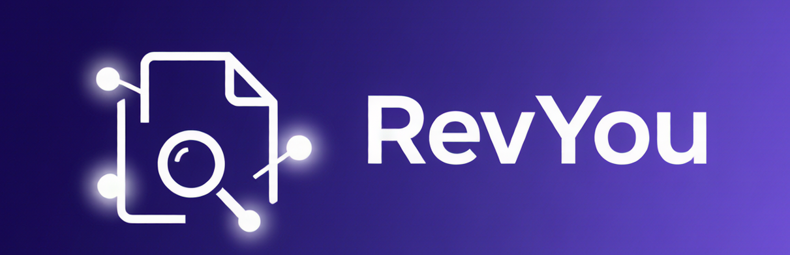
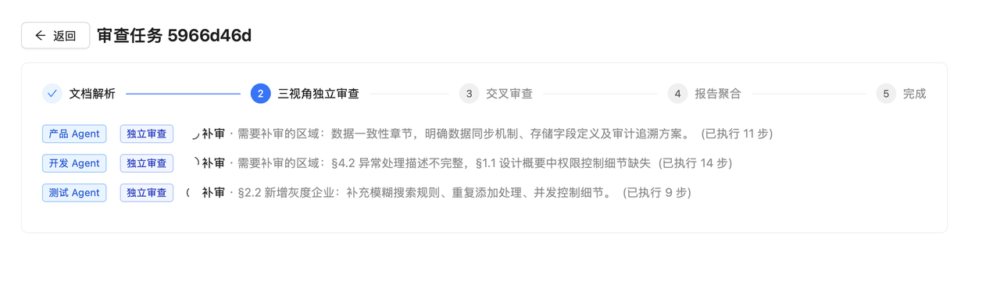
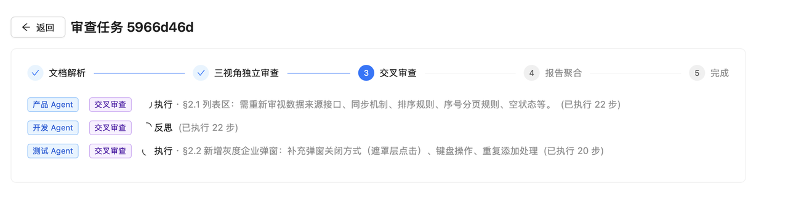
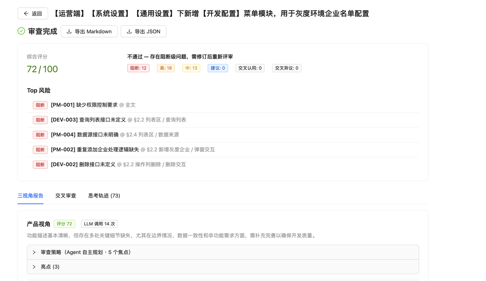
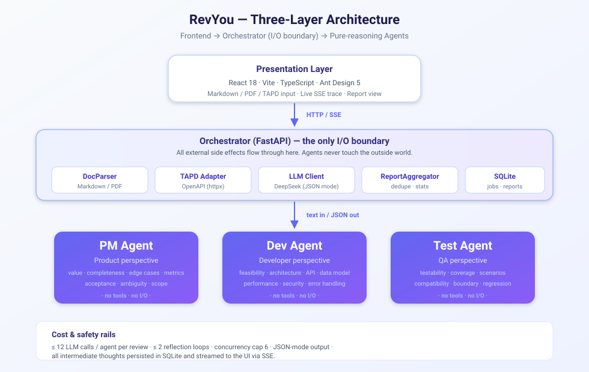
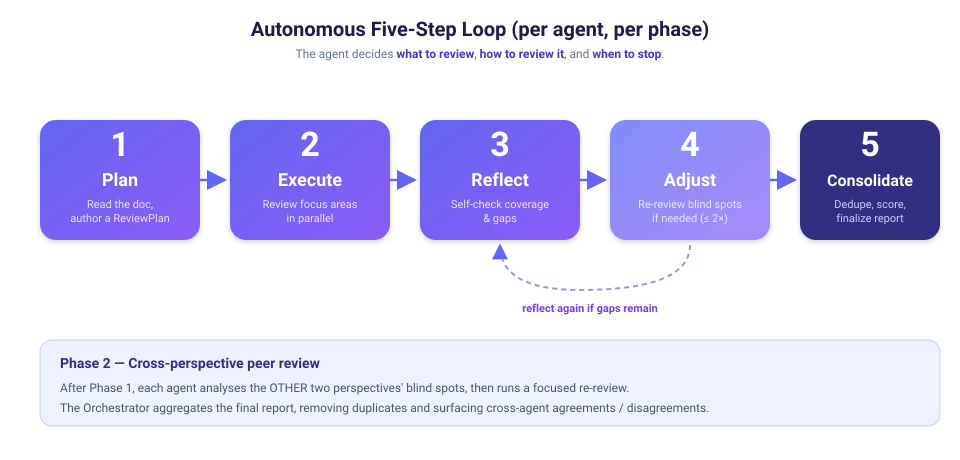

<div align="right">

🌐 **Language:** &nbsp; **[English](README.md)** &nbsp;|&nbsp; [简体中文](README.zh-CN.md)

</div>

<div align="center">



<br/>

<p align="center">
  <a href="https://github.com/89607425/RevYou"></a>
  
  
  
  
  
  <a href="https://github.com/89607425/RevYou/stargazers"></a>
  <a href="https://github.com/89607425/RevYou/issues"></a>
  
</p>

</div>

---

**RevYou** is an **autonomous multi-agent system** that puts three senior reviewers — *Product*, *Developer*, and *Tester* — in front of every requirement document. Each agent runs its own **Plan → Execute → Reflect → Adjust → Consolidate** loop, so the review path is *crafted per document* rather than hard-coded. A second cross-perspective pass closes the blind spots that any single reviewer would have missed.

> ✨ Different requirements produce different review paths. No two reviews look the same.

<br/>

## 📑 Table of contents

- [✨ Highlights](#-highlights)
- [🎬 Demo flow](#-demo-flow)
- [🧠 How it works](#-how-it-works)
- [🏗️ Architecture](#-architecture)
- [🔁 The autonomous agent loop](#-the-autonomous-agent-loop)
- [🧪 Two-phase review](#-two-phase-review)
- [🚀 Quick start](#-quick-start)
- [📂 Project layout](#-project-layout)
- [🌐 API reference](#-api-reference)
- [🧬 Tech stack](#-tech-stack)
- [📏 Design principles](#-design-principles)
- [🗺️ Roadmap](#-roadmap)
- [🤝 Contributing](#-contributing)
- [📄 License](#-license)
- [🙏 Acknowledgments](#-acknowledgments)

---

## ✨ Highlights

- 🧠 **Truly autonomous, not scripted.** Each agent analyzes the document and authors its own `ReviewPlan` — the *what* and *how* of its review — before it lifts a finger.
- 🪞 **Self-correcting loop.** Every pass ends with a reflection step. If the agent decides a focus area is thin, it re-reviews (up to 2 reflection rounds, 12 LLM calls total).
- 🧩 **Three perspectives in parallel.** PM, Dev, and Test review independently first; a cross-perspective pass then asks each agent to chase the blind spots of the other two.
- 🧰 **Three input channels.** Paste Markdown, upload a `.md` / `.pdf` file, or pull a story straight from TAPD via OpenAPI.
- 📜 **Structured reports.** Issues are scored on a four-level severity scale, with cross-agent agreements/disagreements surfaced, and a final readiness verdict.
- 💾 **MySQL-backed persistence.** Every review — final report, full thinking trace, intermediate artifacts — is persisted to MySQL by default (SQLite available as fallback), and the **History** page lets you revisit, re-open, or delete any past review.
- 📡 **Full thinking trace, live.** Every intermediate artifact (plan, execute, reflect, consolidate) is persisted in the database and pushed to the browser via Server-Sent Events.
- 🛡️ **Hard cost & safety rails.** Agents are pure reasoning — they cannot call tools, browse, or hit the network. All I/O is funnelled through the Orchestrator.

---

## 🎬 Demo flow

```text
  ┌────────────┐    ┌─────────────────────┐    ┌────────────────────────┐    ┌──────────────┐
  │ User input │ →  │ Orchestrator parses │ →  │ 3 agents run in parallel│ →  │ Cross-review │
  │ MD / PDF / │    │ & chunks the doc    │    │  (each: Plan→Exec→     │    │ Phase 2      │
  │ TAPD ID    │    │  (token-budgeted)   │    │   Reflect→Adjust→     │    │ (peer-blind) │
  └────────────┘    └─────────────────────┘    │   Consolidate)        │    └──────┬───────┘
                                                 └────────────────────────┘           │
                                                                                     ▼
                                                                          ┌──────────────────┐
                                                                          │ Aggregated       │
                                                                          │ structured report│
                                                                          │ + thinking trace │
                                                                          └──────────────────┘
```

### Phase 1 — three agents in parallel



Each agent independently runs its own five-step loop. Different requirements produce different `ReviewPlan`s — the agents decide for themselves which focus areas to dig into.

### Phase 2 — cross-perspective review



After Phase 1, every agent receives the blind spots surfaced by the other two and runs a focused re-review on them. The labels you see here flip from `独立审查` to `交叉审查`.

### Final aggregated report



The Orchestrator dedupes issues across agents, scores overall quality, counts severities, lists the top risks, and renders a ready-to-export final report (Markdown or JSON).

---

## 🧠 How it works

The system is built around a deliberate separation of concerns:

| Layer        | What it does                                                                                  | What it must **not** do                                       |
|--------------|------------------------------------------------------------------------------------------------|---------------------------------------------------------------|
| **Frontend** | Renders UI, takes input, subscribes to SSE for live trace, shows the final report.            | Talk to the LLM. Talk to TAPD. Persist anything.             |
| **Orchestrator** | Parses docs, calls TAPD OpenAPI, calls the LLM, persists jobs, aggregates reports, streams events. | Generate review content. Make subjective judgments.         |
| **Agents**   | Read text in, emit structured JSON out. Decide what to review, how, and when to stop.         | Touch files, networks, or tools.                             |

That last rule is the most important: **an agent is a pure LLM reasoner**. It cannot browse, cannot call TAPD, cannot read a file, cannot write anywhere. The Orchestrator wraps every LLM call and every side-effect, which makes the agents trivially testable, swappable, and cheap to reason about.

---

## 🏗️ Architecture



- The **Frontend** (React 18 + Vite + Ant Design 5) is a thin client. It talks to the Orchestrator over HTTP and SSE only.
- The **Orchestrator** is a FastAPI process that owns *every* external interaction: document parsing, TAPD OpenAPI calls, LLM calls, SQLite persistence, SSE event fan-out, and final report aggregation.
- The **Agents** are three identical 5-step loops, one per persona (PM, Dev, Test). They share no state, run concurrently, and exchange nothing except their final reports.

---

## 🔁 The autonomous agent loop



Each agent is a five-step closed loop, run **once per phase**:

1. **Plan** — the agent reads the requirement and authors a `ReviewPlan`: which focus areas to dig into, in what order, and why.
2. **Execute** — the agent reviews each focus area in parallel, emitting structured issues with severity, evidence, and rationale.
3. **Reflect** — the agent inspects its own output, asks "what did I miss?", and writes a `ReflectionReport`.
4. **Adjust** — *conditional*. If the reflection flags genuine gaps, the agent re-reviews those focus areas (capped at 2 reflection rounds to bound cost).
5. **Consolidate** — the agent dedupes, scores, and produces its final per-agent report (max 15 issues to keep token usage bounded).

A single review typically produces **30–60 LLM calls** in total (three agents × two phases, each with up to ~10 calls). The whole thing finishes in about 1–2 minutes on DeepSeek.

---

## 🧪 Two-phase review

| Phase                          | What happens                                                                                  |
|--------------------------------|------------------------------------------------------------------------------------------------|
| **Phase 1 — independent**      | PM, Dev, and Test each read the document cold and run their full five-step loop.               |
| **Phase 2 — cross-perspective**| Each agent receives the *other two* agents' blind spots and runs a focused re-review on them. |
| **Aggregation**                | The Orchestrator dedupes issues (fuzzy match on title + evidence), computes cross-agent agreement, scores top risks, and emits the final readiness verdict. |

Cross-agent agreement is a strong signal: if PM and Test both flag the same gap, the team should pay attention.

---

## 💾 Persistent storage

Every review — final report, full thinking trace, and all intermediate artifacts — is persisted to the configured storage backend. The default is **MySQL** (recommended for shared / long-running deployments), with **SQLite** available as a single-machine fallback.

```text
┌────────────────────────────────────────────────────────────────────┐
│  MySQL (default)            SQLite (fallback)                      │
│  ──────────────────         ─────────────────                      │
│  • PyMySQL + DBUtils pool   • Zero-config, file-based              │
│  • InnoDB / utf8mb4         • Single-process safety                │
│  • ON DELETE CASCADE        • Foreign keys enforced                 │
│  • Backs concurrent users   • Ideal for local-only or solo dev      │
└────────────────────────────────────────────────────────────────────┘
```

Both backends implement the same `SessionStoreBase` interface, so swapping is a one-line config change (`STORAGE_BACKEND=sqlite`) with no code edits.

| Environment variable   | Default            | Description                                |
|------------------------|--------------------|--------------------------------------------|
| `STORAGE_BACKEND`      | `mysql`            | `mysql` (default) or `sqlite` (fallback)   |
| `MYSQL_HOST`           | `127.0.0.1`        | MySQL host                                 |
| `MYSQL_PORT`           | `3306`             | MySQL port                                 |
| `MYSQL_USER`           | `root`             | MySQL user                                 |
| `MYSQL_PASSWORD`       | *(empty)*          | MySQL password                             |
| `MYSQL_DATABASE`       | `revyou_reviews`   | MySQL database (auto-created)              |
| `MYSQL_POOL_SIZE`      | `5`                | DBUtils connection pool size               |
| `DB_PATH`              | `data/review.db`   | SQLite file path (only when fallback)      |

Schema is auto-created on first start. Foreign keys with `ON DELETE CASCADE` mean deleting a job cleans up all its thinking steps in one call.

> 💡 The frontend **History** page (`/history`) is the easiest way to look at what was saved — it supports keyword search, source-type and status filters, and inline delete.

---

## 🚀 Quick start

### Prerequisites

- **Python ≥ 3.10** (Anaconda or venv both fine — the project ships an example for `conda activate revyou`)
- **Node.js ≥ 18** (for the Vite frontend)
- A **DeepSeek API key** (or any OpenAI-compatible endpoint; configure via env vars)
- *(Optional)* A **TAPD API token** if you want the in-app TAPD integration

### 1. Clone & configure

```bash
git clone https://github.com/89607425/RevYou.git
cd RevYou

# Backend
cd backend
cp .env.example .env
# Edit .env and fill in:
#   LLM_API_KEY=sk-...
#   MYSQL_PASSWORD=...        (or set STORAGE_BACKEND=sqlite to skip MySQL)
#   TAPD_TOKEN=...            (only if you need TAPD)
#   TAPD_WORKSPACE_IDS=...    (comma-separated)
```

### 2. Run the backend

```bash
conda activate revyou        # or your venv of choice
pip install -r requirements.txt
uvicorn app.main:app --host 127.0.0.1 --port 8000
```

The interactive API docs are now at <http://127.0.0.1:8000/docs>.

### 3. Run the frontend

```bash
cd ../frontend
npm install
npm run dev
```

Open <http://localhost:5173>, paste or upload a requirement, and watch the agents work.

### 4. Run the tests

```bash
cd backend
python -m pytest tests/ -v
```

The suite covers the document parser, the LLM JSON-recovery logic, the agent runner, and the report aggregator.

---

## 📂 Project layout

```text
RevYou/
├── backend/
│   ├── app/
│   │   ├── main.py                    # FastAPI entry point
│   │   ├── config.py                  # Pydantic settings (loads .env)
│   │   ├── models/                    # Pydantic data models
│   │   ├── routers/                   # /api/review, /api/jobs, /api/tapd
│   │   ├── services/
│   │   │   ├── agent_runner.py        # ★ The five-step autonomous loop
│   │   │   ├── orchestrator.py        # Main state machine
│   │   │   ├── doc_parser.py          # Markdown / PDF parsing
│   │   │   ├── llm_client.py          # DeepSeek client + JSON salvage
│   │   │   ├── prompt_manager.py      # Prompt template loader
│   │   │   ├── context_builder.py     # Token-budgeted context assembly
│   │   │   ├── report_aggregator.py   # Cross-agent deduplication & scoring
│   │   │   ├── tapd_adapter.py        # TAPD OpenAPI client
│   │   │   └── event_bus.py           # In-process SSE event bus
│   │   └── storage/                   # Pluggable persistence (MySQL | SQLite)
│   │       ├── base.py                # Abstract storage interface
│   │       ├── mysql_store.py         # MySQL backend (default, recommended)
│   │       └── sqlite_store.py        # SQLite fallback (single-machine)
│   ├── prompts/
│   │   ├── phase1/                    # plan / execute / reflect / consolidate
│   │   ├── phase2/                    # cross-perspective pass
│   │   └── roles/                     # PM / Dev / Test domain prompts
│   └── tests/                         # Pytest suite
├── frontend/
│   ├── src/
│   │   ├── pages/                     # Home, Report, History pages
│   │   ├── components/                # Trace viewer, issue cards
│   │   ├── api/                       # Fetch + SSE client
│   │   ├── App.tsx
│   │   └── main.tsx
│   ├── index.html
│   ├── package.json
│   └── vite.config.ts
├── docs/
│   └── images/                        # README diagrams & logo
├── .env.example                       # Template — never commit your real .env
├── .gitignore
├── README.md                          # ← you are here
└── README.zh-CN.md                    # 简体中文版
```

---

## 🌐 API reference

| Endpoint                              | Method | Description                                          |
|---------------------------------------|--------|------------------------------------------------------|
| `/api/review/markdown`                | POST   | Submit raw Markdown for review                       |
| `/api/review/file`                    | POST   | Upload a `.md` or `.pdf` file                        |
| `/api/review/tapd`                    | POST   | Pull a story from TAPD and review it                 |
| `/api/jobs`                           | GET    | List past reviews (filters: `status`, `source_type`, `keyword`, paginated) |
| `/api/jobs/{job_id}`                  | GET    | Fetch job status + final report                      |
| `/api/jobs/{job_id}/events`           | GET    | Subscribe to live SSE trace                          |
| `/api/jobs/{job_id}/trace`            | GET    | Replay the full thinking trace                       |
| `/api/jobs/{job_id}`                  | DELETE | Delete a job (and all its thinking steps)            |
| `/api/tapd/stories/search`            | GET    | Search TAPD stories by keyword                       |
| `/api/tapd/stories/fetch`             | POST   | Preview a TAPD story before review                   |

Full interactive docs at `http://127.0.0.1:8000/docs` once the backend is running.

---

## 🧬 Tech stack

**Backend**

- 🐍 Python 3.10+ with Pydantic v2
- ⚡ FastAPI + Uvicorn
- 🤖 DeepSeek (OpenAI-compatible chat completion, JSON mode, `max_tokens=8192`)
- 🗄️ MySQL 8.0+ via `PyMySQL` + `DBUtils` connection pool (SQLite available as a single-machine fallback)
- 📄 `python-markdown` for MD parsing, `PyMuPDF` for PDF
- 🌐 `httpx` for TAPD OpenAPI
- 🧪 `pytest` for the test suite

**Frontend**

- ⚛️ React 18 + TypeScript 5
- ⚡ Vite 5
- 🎨 Ant Design 5
- 🧭 React Router 6
- 📡 Native `EventSource` for SSE

> No LangChain, no LlamaIndex, no heavyweight agent framework. The five-step loop is hand-rolled in roughly 350 lines of Python in `agent_runner.py` — small enough to read in one sitting.

---

## 📏 Design principles

1. **Agents are pure reasoners.** No tool calls, no file I/O, no network. Every side-effect is wrapped by the Orchestrator.
2. **Autonomy is scoped.** Agents decide *what* to review, *how* to review it, and *when to stop*. They do not decide tooling or overall flow.
3. **Small core, big leverage.** The Orchestrator stays under ~1000 lines, the agent loop under ~400. The hard problems are in the prompts, not the code.
4. **Local-first, single-user.** No auth, no multi-tenant, no cloud lock-in. Bring your own API key.
5. **Token-aware.** `max_tokens=8192`, `top_p` temperature 0.2, JSON mode, plus a JSON-recovery pass that salvages truncated outputs instead of throwing them away.
6. **Boring infrastructure on purpose.** MySQL + DBUtils for storage, FastAPI, Vite. The interesting work is the agent loop, not the plumbing.

---

## 🗺️ Roadmap

- [x] Three-agent five-step loop with reflection & re-review
- [x] Cross-perspective Phase 2
- [x] TAPD OpenAPI integration
- [x] Live SSE trace streaming
- [x] Structured aggregated report
- [x] Bilingual README (EN / 简体中文)
- [x] MySQL-backed persistence with History page
- [ ] Diff review — review a *diff* of two requirement versions, not just the latest one
- [ ] Historical quality score — track how review quality evolves over time
- [ ] Pluggable LLM providers (OpenAI / Anthropic / local Ollama) with per-provider prompt tuning
- [ ] Export the full report as a printable PDF
- [ ] Multi-tenant mode (optional, behind a flag)
- [ ] Inline comment anchors — link each issue to a specific span of the source doc

---

## 🤝 Contributing

Issues, PRs, and ideas are very welcome. A few guidelines to keep the bar high:

1. **Keep the agent loop small.** If a feature needs more than ~50 lines inside `agent_runner.py`, it probably belongs in the Orchestrator.
2. **Add a test.** Anything in `services/` that can be unit-tested should be.
3. **Don't smuggle I/O into the agents.** The "agents are pure" rule is non-negotiable — it's what makes the system testable and cheap.
4. **Prompt changes are first-class.** Touch a prompt? Update the relevant role doc and re-run the smoke review.

```bash
# Local dev loop
git checkout -b feature/your-thing
# ...make your change...
cd backend && python -m pytest tests/ -v
git commit -m "feat: describe what changed and why"
```

---

## 📄 License

This project is released under the **MIT License** — see [`LICENSE`](LICENSE) for details.

> 💡 If you find RevYou useful, a star ⭐ on GitHub is the easiest way to say thanks and helps others discover it.

---

## 🙏 Acknowledgments

- **DeepSeek** for the high-quality, low-cost OpenAI-compatible inference that makes a 50-call review affordable.
- **TAPD** for a clean OpenAPI surface that just works.
- The **Ant Design** team for the design language that keeps the UI consistent.
- Every open-source project that this stack stands on — FastAPI, React, Vite, PyMuPDF, Pydantic, and the long tail of libraries that turn weekend hacks into real tools.

---

<div align="center">

<sub>Built with ❤️ and a stubborn belief that requirements deserve a real review, not a checklist.</sub>

<br/>

🌐 **[English](README.md)** &nbsp;|&nbsp; [简体中文](README.zh-CN.md)

</div>
